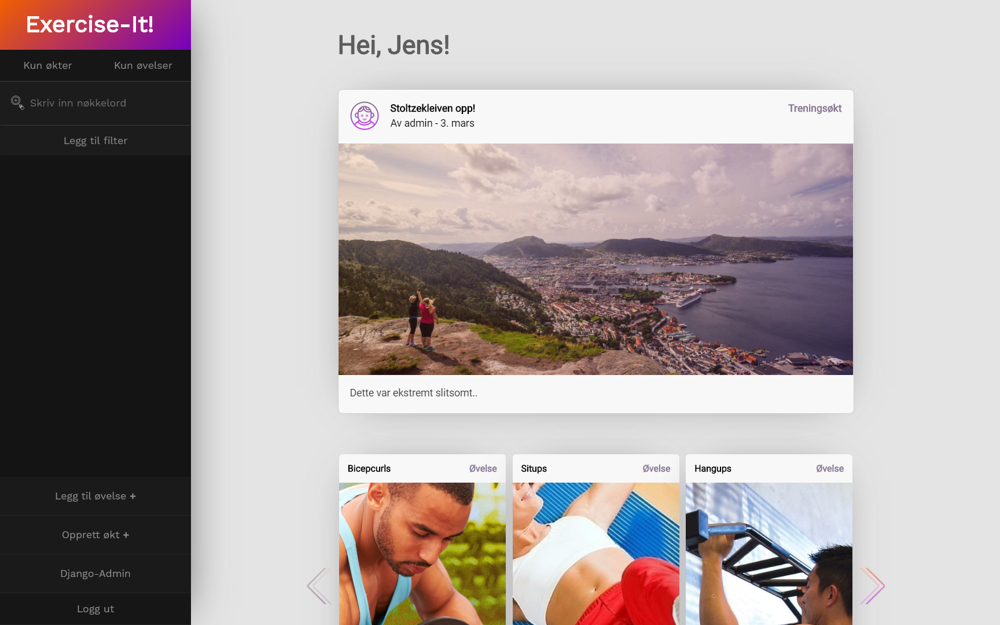

# Requirements

You will need to have installed node.js, git, python and virtualenv.
Get node from [https://nodejs.org/](https://nodejs.org/).
Get git from [https://git-scm.com/downloads](https://git-scm.com/downloads).
Get python from [https://www.python.org/downloads/](https://www.python.org/downloads/).
Install virtualenv from the terminal:
```bash
pip install virtualenv
```

Clone the project:
```bash
git clone https://gitlab.stud.idi.ntnu.no/tdt4140-2020/62.git exercise-it
```

# `macOS`

## Start (or install) Exercise.it

Open your terminal, and go into the project directory.
Start exercise.web:

```bash
cd exercise-it
bash npmstart.sh
```

Open another terminal-window, and go into the project directory:
Start exercise.api:

```bash
cd exercise-it
bash runserver.sh
```

## Info

If you miss node_modules or a virtualenv environment, these will be installed.

Runs the web app on [http://localhost](http://localhost).
Runs the api server on [http://localhost:8000](http://localhost:8000).

# `Windows`

## Start (or install)  Exercise.it

Make sure you have a bash-terminal installed.
Open the project in Windows Explorer.

Run the launch-file:
> exercise-run.cmd

## Info

If you miss node_modules or a virtualenv environment, these will be installed.

Runs the web app on [http://localhost](http://localhost).
Runs the api server on [http://localhost:8000](http://localhost:8000).

# Testing

Tests are run automatically. In GitLab CI/CD, you will find pipelines for web-testing and api-testing.

# Learn More

Check out our GitLab Wiki for a guide on how to use Exercise.it. 

To learn React, check out the [React documentation](https://reactjs.org/).
To learn Django, check out the [Django documentation](https://docs.djangoproject.com/en/3.0/).
To learn Django REST Framework, check out the [documentation](https://www.django-rest-framework.org/).

**Happy exercising!**